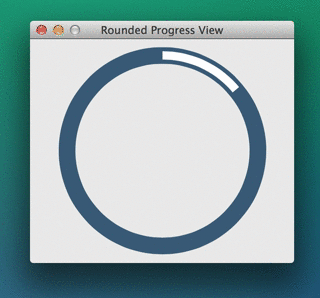

RoundedProgressView
===================

A sample rounded progress view for OS X.

```objc

/// The current progress shown by the receiver.
@property (nonatomic, assign) CGFloat progress;

/// The line width of the receiver progress bar, defaults to 3.0f.
@property (nonatomic, assign) CGFloat progresslineWidth;

/// The progress line color, defaults to light gray.
@property (nonatomic, strong) NSColor *progressLineColor;

/// The line width of the receiver background bar, defaults to 6.0f.
@property (nonatomic, assign) CGFloat backgroundLineWidth;

/// The background line color, defaults to dark gray.
@property (nonatomic, strong) NSColor *backgroundLineColor;

/// Specifies the basic duration of the animation, in seconds, defaults to 0.4.
@property (nonatomic, assign) CFTimeInterval duration;

/// Adjusts the current progress shown by the receiver, optionally animating the change.
- (void)setProgress:(CGFloat)progress animated:(BOOL)animated;

@end

```



